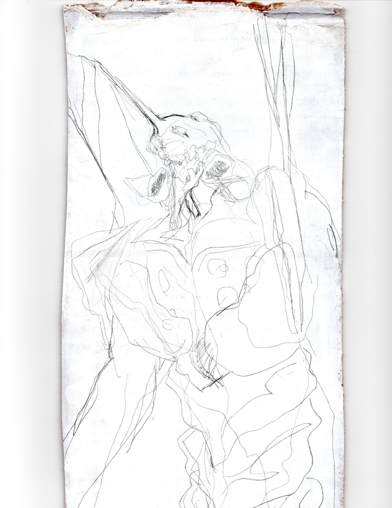

  

 

# Hi there, I'm Selena 👋

> Computer Science @ George Mason University · Systems, Audio & Full-Stack Development

---

### 🔭 About Me
- 💻 **Building & Engineering:** Distributed systems, backend microservices, and audio DSP / web audio engines.
- 🛠️ **Tech Stack:** Python, Java, C, x86-64, TypeScript, React, FastAPI, Docker, PostgreSQL, Redis.
- 🎧 **Audio & Sound:** Low-level digital synthesizers (ADSR, phase modulation), DAW workflows, and bass guitar.
- ⚡ **Fun Fact:** When not writing code, you can find me playing bass or sketching mechanical forms.

---

### 🛠️ Languages & Tools
